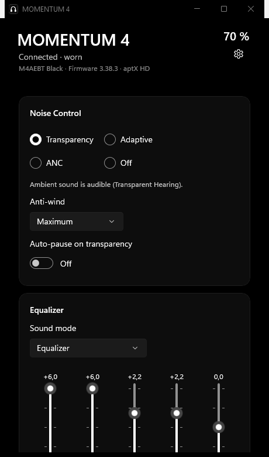

# MOMENTUM 4 Control

Unofficial desktop app for the Sennheiser MOMENTUM 4 Wireless. It talks to the headset over Bluetooth
(RFCOMM, GAIA) straight from Windows and runs locally. No cloud, no account, no telemetry.

Not affiliated with Sennheiser or Sonova.



The interface is English or German. It follows your Windows display language and you can switch it in the settings.
This README and the license are English.

## Features

All of this is checked on a real headset (firmware 3.37.3 and 3.38.3).

- Battery and charging state, model and firmware
- Noise control: Transparency, ANC with adjustable strength, Adaptive ANC, Off, plus anti-wind (off, maximum, automatic)
- Equalizer: 5 bands at the headset's own frequencies, bass boost, sound mode (Equalizer, Podcast, Neutral), and presets you can save
- Behaviour toggles: on-head detection, smart pause, touch controls, auto-answer, comfort call, tones and voice prompts, auto power-off
- Multipoint: list the paired devices and connect to one
- Tray icon with a quick panel on left-click and the full menu on right-click; about 5 MB of RAM while it sits in the tray
- Reads the battery over Windows when the GAIA link is down (shown as "(Windows)")
- Rename the headset
- A small command line, `m4ctl`, for scripts and hotkeys
- Optional start with Windows, minimized to the tray
- Reconnects on its own when the headset comes back
- Diagnostics export as a ZIP, anonymised by default
- Optional update check against the GitHub releases (off by default)

What you change is saved in the headset, so it carries over to your phone and mostly survives a power cycle. The one
exception is Transparent Hearing, which is always off right after the headset powers on.

## Requirements

- Windows 11 (x64). Windows 10 (2004 or newer) should work but I haven't tested it.
- Bluetooth, with the MOMENTUM 4 already paired in Windows.
- Firmware 3.37.3 or 3.38.3. Other 3.x versions should be fine. The app unlocks features by firmware and only sends
  commands it has verified on the device.

## Installation

Each release has two builds. Both are self-contained, so you don't need a .NET runtime or the Windows App SDK.

**Installer** (`Momentum4Control-Setup-<version>.exe`): just run it. It installs per user without admin rights, adds a
Start-menu shortcut, can enable autostart, and registers a normal uninstaller under *Apps & features*.

**Portable** (`Momentum4Control-<version>-portable.zip`): unzip it somewhere you can write to and run
`Momentum4Control.exe`. Settings, logs and presets go into a `Data` folder next to the exe instead of `%LOCALAPPDATA%`.

The exe isn't signed, so Windows SmartScreen warns you on the first start.

## Usage

The window has noise control, the equalizer with presets, and the device list; battery and the settings gear are top
right. Closing the window leaves the app in the tray. Quit it from the tray menu.

Left-click the tray icon for a small quick panel, double-click for the window, right-click for the full menu.

`m4ctl.exe` sits next to the app. If the app is running it forwards the command through it (about 30 ms), otherwise it
connects on its own (about 1.5 s). `m4ctl help` lists everything:

```powershell
m4ctl status
m4ctl mode toggle          # Transparency <-> ANC, good for a hotkey
m4ctl strength 80          # ANC strength
m4ctl preset MyCurve
m4ctl battery              # just the number, for scripts
m4ctl autooff 30
```

Settings, presets and logs are in `%LOCALAPPDATA%\Momentum4Control\`. Logs are deleted after 14 days.

## What it doesn't do

- There's no "disconnect device" button. On some firmware that command wiped the pairing, so it stays blocked.
  Disconnect from the other device instead.
- It can't put the headset into pairing mode. Do that on the headset.
- Sound Personalization (sound mode 3) is left alone; its preconditions aren't clear.
- The bundled EQ presets are my own, not the ones from Smart Control.
- Only one paired MOMENTUM 4 at a time.
- The phone's Smart Control app uses the same channel. I haven't tested both connected at once.

## Troubleshooting

| Message | What it means |
|---|---|
| "No headset — no paired MOMENTUM 4 found" | Pair the headphones in Windows' Bluetooth settings, then hit "Search again". |
| "MOMENTUM 4 disconnected" | Headset off, out of range, or Bluetooth off. The app reconnects by itself; "Reconnect" tries right away. |
| "Not applied: not accepted by the headset" | The headset acknowledged the command but didn't change the value. You see the real state. |
| "Not applied: no response from the headset" | Wait a moment. After repeated timeouts the app rebuilds the connection. |
| A device won't connect | It may have forgotten the pairing, so re-pair it on the device. Only 2 connections are possible at once. |
| Autostart doesn't fire | Settings, then read the hint under "Start with Windows": it says if the entry was turned off in Task Manager or points at a different exe. |

For anything else: turn on protocol logging in the settings, reproduce the problem, then use "Export diagnostics". The
export is anonymised.

## Building from source

```powershell
dotnet build Momentum4Control.slnx
dotnet test --solution Momentum4Control.slnx      # ~380 tests, replayed against captures from a real headset
.\tools\publish-app.ps1                           # Native AOT release -> %LOCALAPPDATA%\Momentum4Control.build\publish\app
.\tools\make-release.ps1                          # setup.exe + portable.zip (needs Inno Setup 6)
```

You need the [.NET SDK 10.0.401+](https://dotnet.microsoft.com/download) (pinned by `global.json`) and the Visual
Studio Build Tools with "Desktop development with C++" for the Native AOT build.

The projects: `Momentum4.Protocol` (framing, codecs, the command catalog), `Momentum4.Core` (queue, state, service),
`Momentum4.Bluetooth` (WinRT RFCOMM), `Momentum4.App` (WinUI 3), and `tools/Momentum4.Poc` (`m4poc`, a command line
for hardware tests).

The app only sends commands from the catalog that were verified on hardware. The dangerous ones (firmware, reset,
deleting pairings) are blocked in every policy. A debug build adds a read-only protocol inspector under Settings →
Advanced. The workflows in [`.github/workflows/`](.github/workflows/) run the tests on Linux and the whole solution
(build, tests, format, Native AOT) on Windows; `release.yml` builds the installer and portable zip on a `v*` tag.

## Privacy

The app talks to the headset over Bluetooth and writes to `%LOCALAPPDATA%\Momentum4Control\` and, for autostart, to
`HKCU\Software\Microsoft\Windows\CurrentVersion\Run`. The only thing that can reach the internet is the update check,
and it's off by default: when you turn it on (or press "Check now" in the settings) the app asks GitHub's release API
for the latest version, nothing else. Leave it off and nothing leaves your machine.

## Credits

The protocol knowledge builds on these reverse-engineering projects:

- [Zhengyang-Liu/m4-companion](https://github.com/Zhengyang-Liu/m4-companion) (MIT)
- [DanSmith888/omarchy-momentum4](https://github.com/DanSmith888/omarchy-momentum4) (MIT)
- [jarek102/ohr](https://github.com/jarek102/ohr) (MIT)
- [arjun1194/momentum-control-macos](https://github.com/arjun1194/momentum-control-macos) (MIT)
- [SilentSoulsSr/SenheiserMomentum4](https://github.com/SilentSoulsSr/SenheiserMomentum4) (MIT)
- [gjabell/momentumctl](https://github.com/gjabell/momentumctl) (MIT)
- [zaval/sennheiser-desktop-client](https://github.com/zaval/sennheiser-desktop-client): no stated license, so only
  facts like command IDs were used, no code or assets.

The official Android app **Sennheiser Smart Control Plus** (`com.sonova.chb.control`) was also analyzed locally for
interface information the projects above don't cover, such as renaming the headset. Only interoperability information
was taken (command IDs, payload formats, value ranges), no program code, text or graphics. See **Legal** for the basis.

## Contributing

Issues and pull requests are welcome — bug reports, hardware findings, translations or code. There are a couple of
ground rules (interface facts only, no manufacturer material) in [CONTRIBUTING.md](CONTRIBUTING.md).

## License

Released under the [MIT License](LICENSE). The notices below (no warranty, trademarks, reverse-engineering) also apply.

## Legal

**Applicable law.** This project and the notices below are framed under the law of the **Federal Republic of Germany**
and the **European Union**. The statutory references are to German law (Urheberrechtsgesetz — UrhG, §§ 69a ff.) and to
EU law (Directive 2009/24/EC on the legal protection of computer programs). They are provided for transparency and do
not constitute legal advice.

**No affiliation.** This is an independent, non-commercial, open-source project. It is not affiliated with, endorsed
by, or connected to Sennheiser electronic GmbH & Co. KG, Sonova Consumer Hearing GmbH, or any of their affiliates.
"Sennheiser", "MOMENTUM", "Smart Control" and other names are trademarks of their respective owners; they are used
purely descriptively (nominative use) and imply no trademark relationship.

**No manufacturer material.** This repository and the app contain no Sennheiser, Sonova or Qualcomm software, firmware,
audio prompts, or other assets. The official app that was analyzed for interoperability is neither included nor
redistributed here. The tool is meant for owners of a lawfully acquired MOMENTUM 4.

**Concerns / takedown.** If you hold rights in anything referenced here and have a concern, please open an issue.
I'll respond and act in good faith. See also [THIRD_PARTY_NOTICES.md](THIRD_PARTY_NOTICES.md),
[CONTRIBUTING.md](CONTRIBUTING.md) and [SECURITY.md](SECURITY.md).

**Decompilation for interoperability (§ 69e German Copyright Act / Art. 6 Directive 2009/24/EC).** The interface
information required to control the device is not published by the manufacturer. It was determined by examining
lawfully obtained/installable software and lawfully purchased hardware, within the limits permitted by law, and
restricted to the parts necessary for the interoperability of an independently created program (the protocol layer).
Only **ideas and principles** (§ 69a(2)) and interface information (command IDs, data formats, value ranges) were
obtained and documented. **No form of expression** was taken: no source or object code, no enum or table blocks in
their original wording, no text, graphics, sounds or other protected material. The information is not used for any
purpose other than interoperability, is not passed to third parties except where necessary for interoperability, and
is not used to create a program of substantially similar expression. Any contractual terms to the contrary are void
under § 69g(2). Encrypted or otherwise effectively protected content is not circumvented.

**Warranty disclaimer.** The software is provided without any warranty and is used at your own risk. It sends
Bluetooth commands to the headset; to the extent permitted by law, no liability is accepted for damage to the device,
data loss or other consequences. Commands known to be dangerous (firmware update, factory reset, disconnecting or
deleting pairings) are deliberately blocked.
